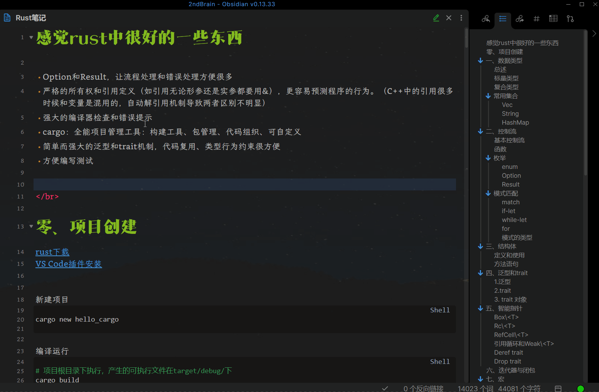
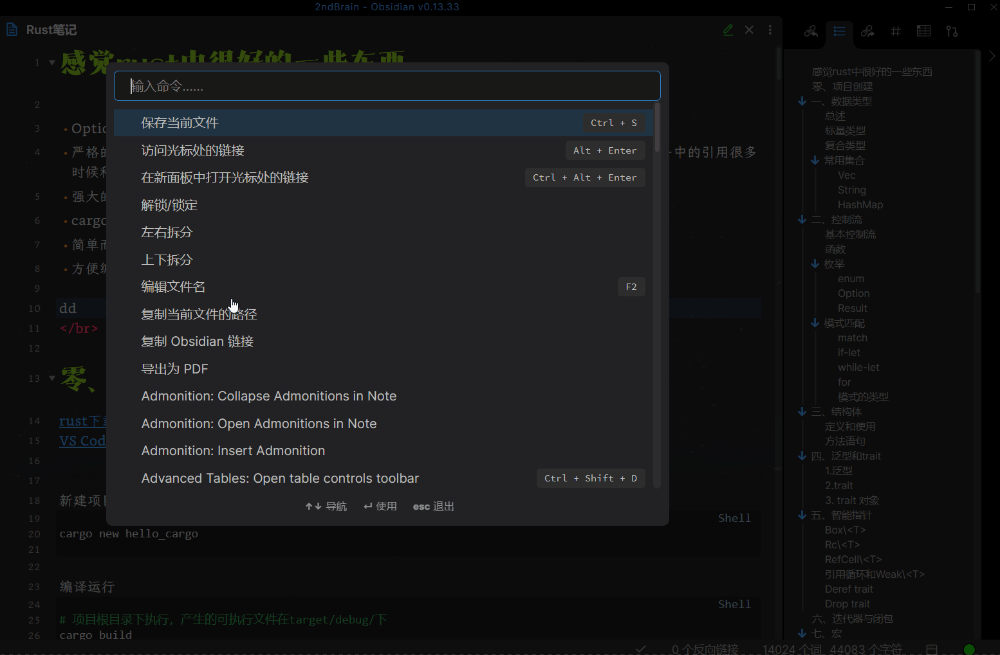
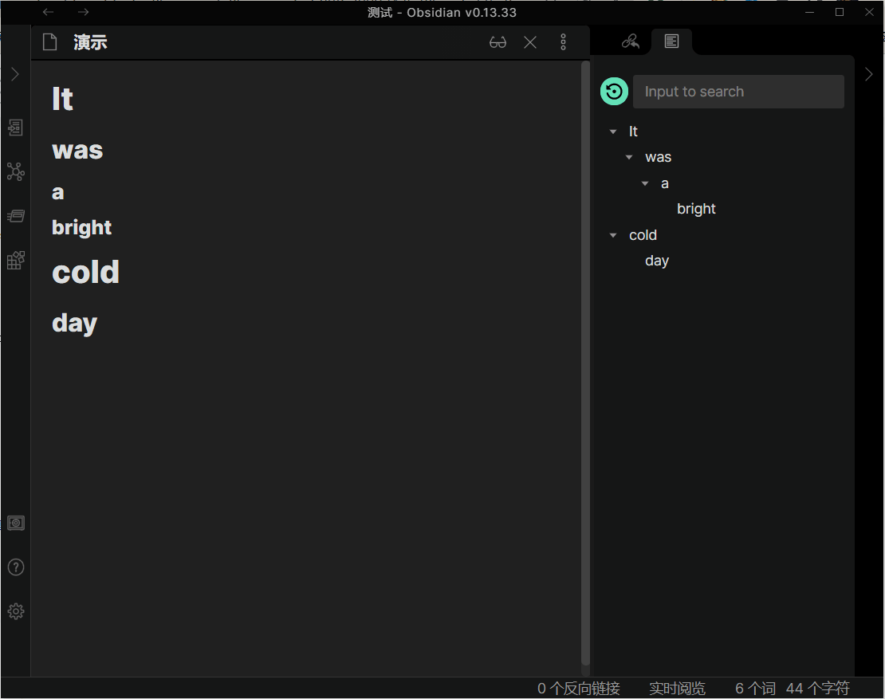
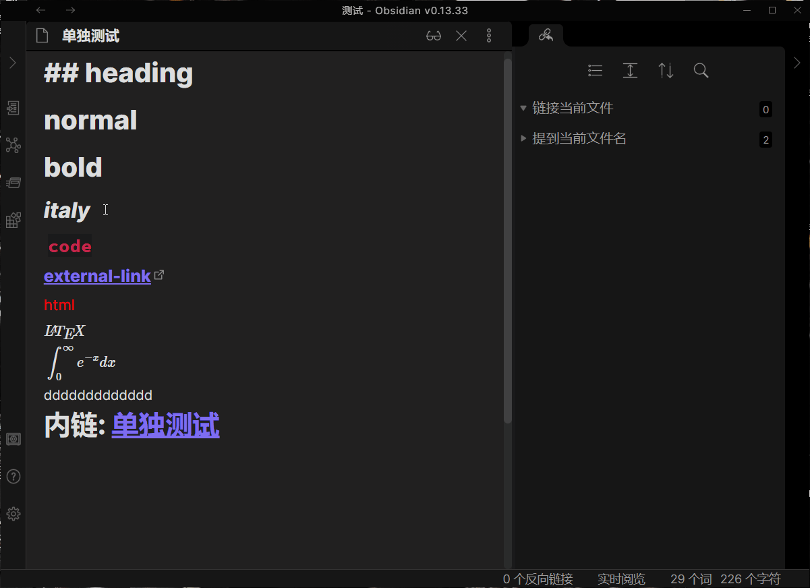

# Obsidian Quiet Outline

An outline plugin makes headings easier to read.

## Features

### No auto-expand when editing

Default Outline: 

Quiet Outline: 

### Search support

### Toggle light/dark mode

### Markdown render support

## Problems Now

+ [ ] Only support jumping in edit mode (no in preview mode).

## Usage

Open command panel and input `Quiet Outline` ，then press `Enter` . 

## Install

+ Download the latest release. 

+ Extract and put the three files (`main.js`, `style.css`, `manifest.json`) to folder `{{obsidian_vault}}/.obsidian/plugins/obsidian-quiet-outline`.

